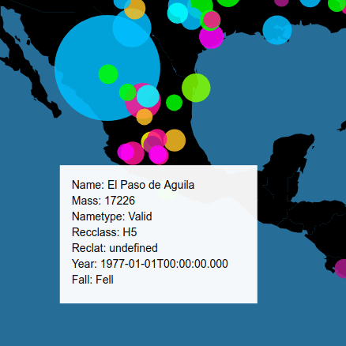

# D3 Geopath

## Description

This project uses d3.js to display where meteorites landed around the world. Radius length of the geo points indicate the relative size of meteorite, and mousing over the point will display a tooltip with further information on the meteorite.

## Live Demo

https://coymeetsworld.github.io/d3-geopath

	

## About

This project was written by Coy Sanders as a requirement in the [Data Visualization Projects](https://www.freecodecamp.com/challenges/map-data-across-the-globe) for [FreeCodeCamp](http://www.freecodecamp.com) to earn the Data-Visualization Development Certification.

software is licensed under the 

Copyright (c) 2017 
